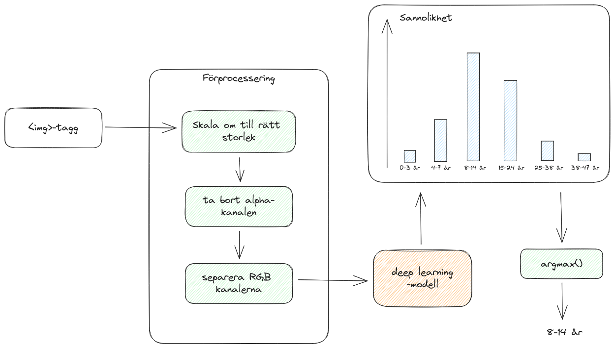
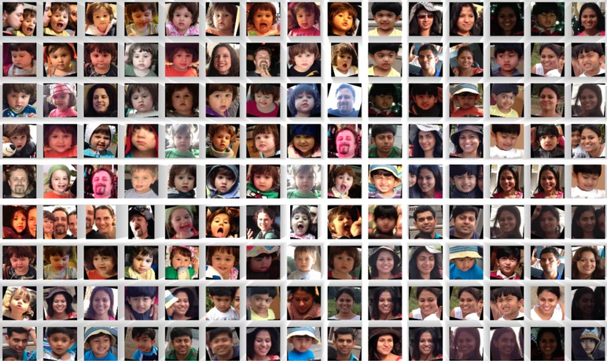
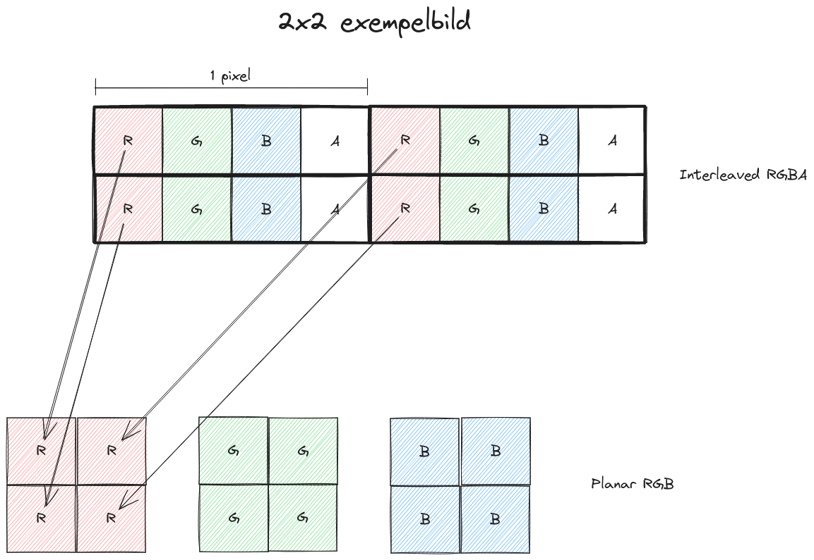
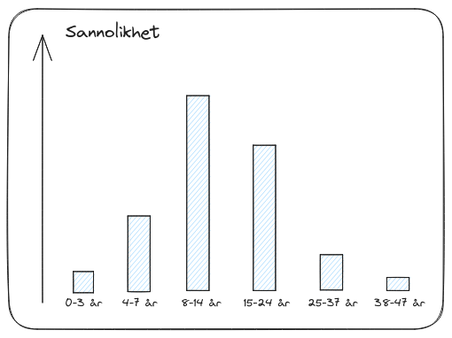

# Labbinstruktioner
Den här filen innehåller övergripande instruktionerna för labben. Om du fastnar eller vill ha ett lösningsförslag direkt kan du kolla i filen `README.md` som innehåller lösningsförslag och fullständig kod för labben. Varje steg länkar också till ett lösningsförslag som du kan kika på om du fastnar.

## Målbild
I den här labben är tanken att vi ska bygga ett system för att estimera ålder från en porträttbild.
Vi kommer att göra detta direkt i webbläsaren med hjälp av ett ramverk som heter `onnxruntime-web`.
Det låter oss utföra inferens med en deep learning-modell som har förtränats för att estimera ålder. 

<!--  -->

<br/>
Den största delen av labben kommer att gå ut på att manipulera indatabilden i ett förprocesseringssteg.
Eftersom modellen vi använder har tränats på en viss typ av bilder (storlek, pixelintensitet, bildformat, motivets position, etc)
är det extremt viktigt att se till att den data vi skickar in matchar detta så nära som det går. 
Annars kan vi inte räkna med att få ett korrekt resultat från modellen.
Det framgår lite tydligare i bilden nedan att förprocesseringen är den största delen av labben.

<br/>
<br/>



<br/>
När vi är klara med förprocesseringen deserialiserar vi modellen, anropar den med vår indata och presenterar resultatet.


## Förberedelser ([lösningsförslag](README.md#förberedelser))
1. Installera `npm` och `npx`.
2. Hämta en testbild i form av ett porträtt du vill åldersbestämma.
3. Hämta den färdigtränade modellen från [https://github.com/onnx/models/blob/main/vision/body_analysis/age_gender/models/age_googlenet.onnx](https://github.com/onnx/models/blob/main/vision/body_analysis/age_gender/models/age_googlenet.onnx)

## Ett enkelt UI  ([lösningsförslag](README.md#ett-enkelt-ui))
I det här steget ska du:
- Installera biblioteket `onnxruntime-web` till projektet.
- Skapa ett enkelt UI som visar bilden som du har laddat ned och en knapp med texten "Estimate Age".

## Förprocessering av indatabilden ([lösningsförslag](README.md#förprocessering-av-indata-bilden))
Modellen som vi kommer att köra förväntar sig ett visst format på indatan för att generera korrekta estimeringar.
Detta beror på att modellen är tränad med ett specifikt dataset (om man är intresserad kan man utforska det datasetet [här](https://datasets.activeloop.ai/docs/ml/datasets/adience-dataset/).



Efter det här steget ska vi ha en funktion `preprocess()` som gör följande när den anropas:
- Skalar om bilden till 224x224
- Plockar ut bilddatan som en array av pixlar av typen Uint8ClampedArray. (För att göra detta måste du först kopiera bilden till en HTML Canvas.)
- Tar bort alpha kanalen som representerar pixlarnas transparens.
- Konverterar bilden till en array av flyttal (Float32Array).
- Konverterar bilden från  "interleaved"-rgb format till "planar"-rgb format. I interleaved formatet är pixeldatan strukturerad så att var tredje element tillhör samma kanal. En 2x2 bild har alltså den underliggande datastrukturen
`RGBRGBRGBRGB`. Vi måste konvertera formatet så att varje kanal ligger för sig. För 2x2 exemplet blir det alltså `RRRRGGGGBBBB`. 
- Subtraherar en normaliseringskonstant från varje pixel för att matcha formatet som modellen tränades med. I vårt fall måste vi subtrahera varje pixelintensitet med `120`. När modellen som vi använder oss av tränades, normaliserades indatabilderna genom att subtrahera medelvärdet av pixelintensiteten innan träningen skedde. Detta är ett vanligt steg när man tränar modeller och görs för att stabilisera träningsprocessen. Om du är intresserad av varför detta är nödvändigt rekommenderar jag att läsa igenom den [här](https://scikit-learn.org/stable/auto_examples/preprocessing/plot_scaling_importance.html#importance-of-feature-scaling) artikeln. Den är en del av dokumentationen till det populära maskininlärningsbiblioteket scikit-learn. Över lag är de väldigt duktiga på att förklara koncept kring maskininlärning i sin dokumentation. I vårt fall finns det beskrivet i modellens dokumentation hur datan har förprocesserats innan träning. [https://github.com/onnx/models/tree/main/vision/body_analysis/age_gender](https://github.com/onnx/models/tree/main/vision/body_analysis/age_gender).

Skillnaden mellan interleaved formatet och planar formatet visualiseras i nedanstående bild för en bild med 2x2 pixlar.


## Använda modellen (inferens) ([lösningsförslag](README.md#använda-modellen-inferens))
Nu har vi äntligen kommit så långt att vi kan anropa modellen med vår bild. Detta steg kallas för inferens och går ut på att skicka vår förprocesserade data till modellen och få ut ett resultat.

I det här steget kommer vi att:
1. Deserialisera en färdigtränad modell från vår age_googlenet.onnx fil som innehåller den färdigtränade modellens vikter.
2. Skapa en Tensor från vår indata med rätt dimensioner.
3. Applicera modellen på den skapade tensorn.

Allt detta görs med `onnxruntime-web` biblioteket via `InferenceSession` och `Tensor` objekten.

### Vad är en Tensor?

Många maskininlärningsmodeller opererar på datatyper som kallas tensorer.
Tensorer kommer från början från fysiken och är en sorts generalisering av matematikens vektorer.
I AI/ML sammanhang har det dock kommit att betyda en flerdimensionell array som är optimerad för matrismultiplikation, en operation som är vanligt förekommande i ML-algoritmer.
Ett exempel på en tvådimensionell tensor är en matris som då har de två dimensionerna: rader och kolumner.
Vår RGB bild råkar också vara en tredimensionell tensor där de tre dimensionerna är: bildens höjd, bredd och antal kanaler.

### Tolkning av utdatan
Något som kan verka konstigt är att en modell som estimerar ålder svarar med en lista istället för bara ett tal.
Förklaringen till det är att modellen inte är helt säker i sin estimering, utan svarar med en sannolikhetsdistribution över åldersintervallen.
Detta är ett resultat av hur modellen är tränad. I vårt fall har modellen tränats att klassificera bilden till ett av åtta åldersintervall.
Då kommer modellen att returnera en lista med sannolikheter för de olika intervallen.

Detta är en vanligt mönster med maskininlärningsmodeller. 
Istället för att direkt returnera ett svar får man ut sannolikheter eller *scores* för de olika *möjliga* svaren.
Det är viktigt att poängtera att även om man ofta benämner dessa *scores* som sannolikheter, så är det egentligen bara modellens *estimering* av den korrekta sannolikheten. Om modellen är tränad på en annan typ av data, eller har inbyggda bias så kommer sannolikheterna inte att representera något rimligt.
Som exempel kan vi tänka oss att vi skickar en helt annan typ av bild till vår modell, till exempel en helt blank bild. Modellen kommer fortfarande att svara med sannolikheter för de 8 åldersintervallen den är tränad på, trots att det inte betyder någonting för en blank bild.

Hur vi väljer att presentera resultatet är upp till oss.
Ett sätt hade varit att rita ut sannolikheterna i ett histogram.



Man kan också tänka sig att man vill se till att bara presentera resultat när modellen är tillräckligt säker, och be användaren använda en annan bild om sannolikheten 
för något intervall inte överstiger ett visst tröskelvärde.

För att göra det enkelt för oss kommer vi att returnera det intervall som har högst sannolikhet enligt modellen utan att ta hänsyn till det egentliga sannolikhetsvärdet. Till exempel skulle vi om vi fick resultatet fån bilden presenterat intervallet 8-12 år eftersom den stapeln är högst.

## Presentation av resultatet ([lösningsförslag](README.md#presentation-av-resultatet))
I det här steget ska tar vi vår utdata i form av en lista med sannorlikheter och presenterar det åldersintervall som har högst sannorlikhet. För att göra detta behöver vi veta vilka intervall som motsvarar vilket index i utdatan. Du kan använda den här listan med strängrepresentationer av intervallen:
```typescript
const AGE_INTERVALS = ['0-3', '4-7', '8-14', '15-24', '25-37', '38-47', '48-59', '60-100'];
```
Listan är hämtad från modellens dokumentation.

# Fortsättningsideer
- Det är fullt möjligt att köra modellen på resultatet från en kameraström, eller låta användaren välja bild från sitt filsystem.
- Nu laddas och deserialiseras modellen varje gång användaren trycker på "Estimate Age". Detta är inte nödvändigt, utan det bör göras direkt när sidan laddar.
- På [https://github.com/onnx/models/tree/main](https://github.com/onnx/models/tree/main) finns en uppsjö av andra intressanta modeller i .onnx format som kan testas.
- Med bibliotek som PyTorch eller Tensorflow kan du träna egna modeller och exportera till .onnx. Dessa modeller går utmärkt att använda på samma sätt som vi gjort i det här exemplet.

## Transfer learning
Ett vanligt användningsområde för färdigtränade modeller är att utnyttja dem till något som kallas för transfer learning.
Detta innebär att man använder den färdigtränade modellen som en del i en ny modell som löser ett liknande men inte identiskt problem.
Säg till exempel att vi behöver en modell som försöker ta reda på om personen på bilden är arg eller glad.
Det man då kan göra är att träna en egen, mindre modell, med åldersestimeringsmodellens output som input.
Eftersom den ursprungliga modellen är tränad på en massa ansikten, kan vi utnyttja delar av modellens "kunskap" för vårt nya problem.
På detta sett behöver vi inte alls lika mycket träningsdata när vi tränar vår nya modell.

I praktiken brukar man inte använda den sista outputen från basmodellen (åldersmodellen) utan utdatan några lager ned i modellen.
Rationalen bakom det är att deep learning-modeller lär sig mer konkreta kunskaper i de första (undre) lagren och mer domänspecifika abstrakta kunskaper de övre.
Därför vill man ignorera de översta lagren i basmodellen som innehåller kunskap som bara är applicerbar på originalproblemet (åldersestimering), 
samtidigt som man vill utnyttja den mer generella kunskapen från de undre lagren.


# Slutsats

